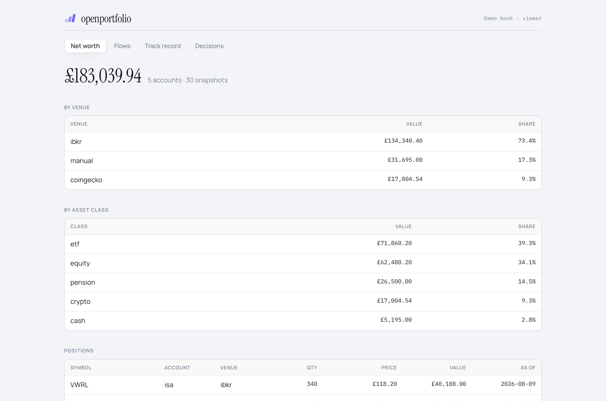
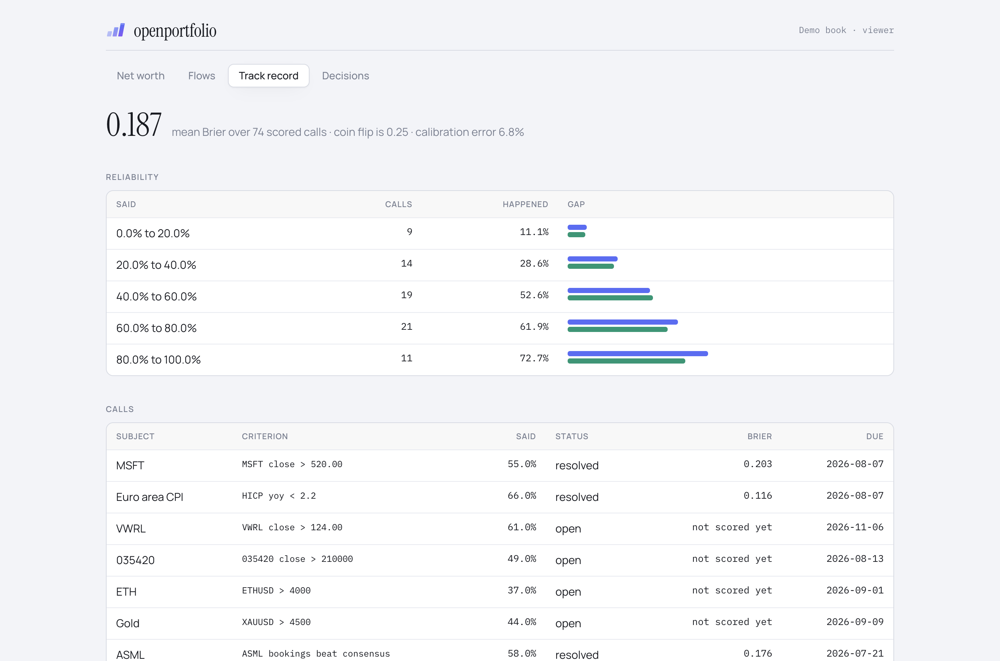
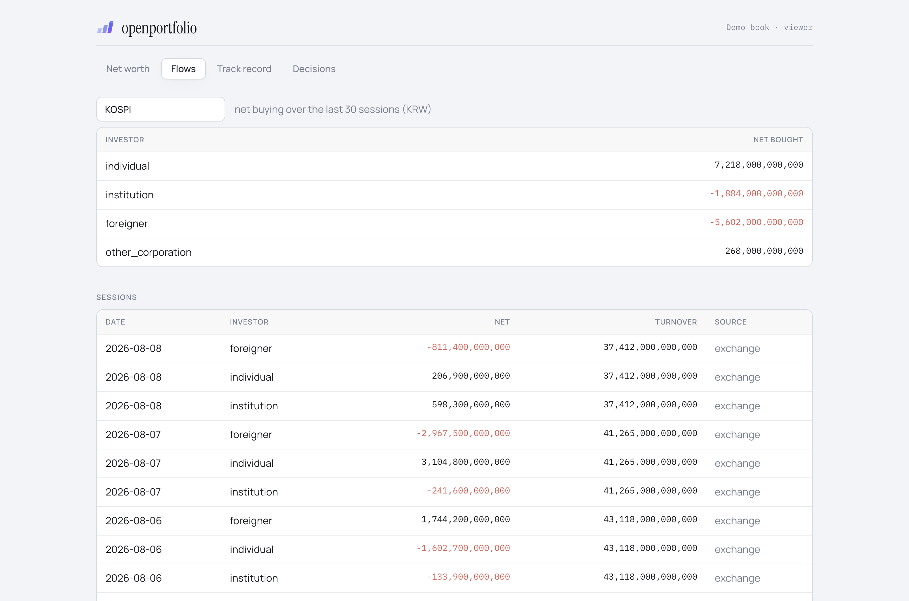

<div align="center">


# openportfolio

**Every account as one book. Every call on the record.**

Open-source, self-hosted portfolio tracker. It pulls every brokerage, pension, wallet and bank
account into a single net worth, stores the investor flows behind the price, and Brier-scores the
forecasts you registered before the fact. No provider API key, anywhere in it.

[](LICENSE)
[](https://www.npmjs.com/package/openportfolio)
[](https://www.typescriptlang.org/)
[](https://github.com/seonglae/openportfolio/stargazers)

**[Website](https://openportfolio.app) · [Docs](https://openportfolio.app/docs/) · [Live demo](https://openportfolio.app/demo/)**

[](https://vercel.com/new/clone?repository-url=https%3A%2F%2Fgithub.com%2Fseonglae%2Fopenportfolio&project-name=openportfolio&repository-name=openportfolio&demo-title=openportfolio&demo-description=Every%20account%20as%20one%20book%2C%20every%20call%20on%20the%20record.%20One%20net%20worth%2C%20the%20investor%20flows%20behind%20the%20price%2C%20and%20a%20Brier-scored%20record%20of%20the%20calls%20you%20registered%20before%20the%20fact.&demo-url=https%3A%2F%2Fopenportfolio.app%2Fdemo%2F&products=%5B%7B%22type%22%3A%22integration%22%2C%22integrationSlug%22%3A%22convex%22%2C%22productSlug%22%3A%22convex%22%2C%22protocol%22%3A%22storage%22%7D%5D&env=VITE_CLERK_PUBLISHABLE_KEY&envDescription=Clerk%20publishable%20key.%20A%20deployed%20book%20is%20private%2C%20so%20it%20needs%20an%20identity%20provider%20to%20know%20who%20you%20are.&envLink=https%3A%2F%2Fopenportfolio.app%2Fdocs%2Fdeploy)

<sub>Dashboard and backend in one click. The sync worker runs on your machine, by design: see [Deploying](https://openportfolio.app/docs/deploy).</sub>

</div>



<sub>Screenshots show the demo book. Every figure in them is invented.</sub>

> **Status: pre-release.** It runs and the setup below works. Interfaces will still move.

**It is not a trading bot.** The backend has no function that places an order, the adapters that
ship declare `canPlaceOrders: false`, and `PlaceOrderRequest` requires an `OrderConfirmation` that
has no default. What it does is aggregate, watch, and keep score.

## Why

Two problems that look unrelated and are the same problem.

**A portfolio is scattered by construction.** A broker here, a pension there, an ISA, an exchange
account, a bank balance, a holding that no API will ever return. Every one of those apps shows you
a number, and none of them shows you yours. So the figures that actually decide things, the total,
the concentration in one name, the share of the book sitting in a currency you do not spend, are
the figures nobody has. They get estimated, and the estimate is generous in the direction that
avoids a decision.

**Market commentary is unaccountable**, and became more so the moment a model would produce a
confident directional view on anything you asked it. The problem is not that the views are wrong.
It is that being wrong costs nothing and leaves no trace, so a forecaster worth reading and a
forecaster who is merely fluent are indistinguishable from the outside, and from the inside too.

Both are bookkeeping failures, so openportfolio treats them as bookkeeping.

|                            |                                                                                                                                                                                                                                                                                                             |
| -------------------------- | ----------------------------------------------------------------------------------------------------------------------------------------------------------------------------------------------------------------------------------------------------------------------------------------------------------- |
| **One net worth**          | Accounts pulled through venue adapters into a single base currency, with the rate stored on the row it converted, so a snapshot records what the book was worth then rather than what today's rates say. Positions held in three places are one exposure.                                                   |
| **Flows, not just prices** | Price is the output of who was buying and who was made to sell. Net buying by investor type, turnover, and a calendar of dated forward events are stored as first-class series, not derived when somebody remembers to ask. A forced seller is on a schedule, and the schedule is public.                   |
| **A scored track record**  | A call is registered before the fact with a probability, a horizon and the condition that settles it. When the horizon passes, the machine-resolvable ones settle themselves and are Brier-scored. The reliability diagram is the product: it shows what you said, what happened, and the gap between them. |

There is a fourth table that exists for one reason. A recommendation phrased as "wait for the
print, then decide" evaporates the moment it is said out loud. `decisions` is a queue of those,
each with a trigger condition and an outcome, and they stay on the board until one of them changes.

<table>
<tr>
<td width="50%"></td>
<td width="50%"></td>
</tr>
<tr>
<td align="center"><sub><b>Track record.</b> Said versus happened, bucket by bucket.</sub></td>
<td align="center"><sub><b>Flows.</b> Net buying by investor type, turnover on the same row.</sub></td>
</tr>
</table>

## No provider API key

Watching a book is only useful if something is actually watching: reconciling after the close,
settling a call the day its horizon passes, noticing that a deferred decision came due three weeks
ago.

Metered inference is the wrong shape for that. When each run bills per token, every autonomous
check becomes a purchase, and a product that spends the operator's money unprompted has to ask
first, or batch, or ration. All three turn a portfolio that watches itself into a portfolio that
asks permission to look.

So every model call is dispatched instead to an agent CLI you are already signed in to: `codex`,
`antigravity`, or `claude`, with a per-task fallback order. There is no provider key in this repo and
no field to put one in. That does not make a run free: subscription plans have rate limits, and the
fallback chain exists partly because one provider runs out before the others do. What changes is
the kind of limit. Agent work is bounded by quota and wall clock rather than by spend, so it never
has to be justified one invocation at a time.

The consequence is that **openportfolio is self-hosted by design**. Your deployment runs your syncs
on your machine under your own logins, against your own accounts.

## What it does

| Surface       |                                                                                                                       |
| ------------- | --------------------------------------------------------------------------------------------------------------------- |
| Net worth     | accounts, balances, per-venue and per-asset-class breakdown, snapshots in one base currency, keyless FX               |
| Venues        | adapter contract with declared capabilities; a reference keyless quote adapter and a manual one                       |
| Flows         | net buying and turnover by investor type per session, per market or per symbol                                        |
| Forecasts     | probability, horizon and resolution criterion; auto-resolution on horizon expiry; Brier score and reliability buckets |
| Decisions     | the deferred-decision queue, with trigger conditions and outcomes                                                     |
| Catalysts     | dated forward events and the assets they touch                                                                        |
| Audit         | append-only record of every state-changing mutation, including what the cron did unattended                           |
| MCP           | 25 tools so `codex` / `antigravity` / `claude` can read and write the book directly                                   |
| Multi-tenancy | every table scoped to a tenant, every index leading with it, one service key per tenant                               |

## Quick start

Node 22+, pnpm, and a [Convex](https://convex.dev) account. The free tier is enough.

```bash
git clone https://github.com/seonglae/openportfolio.git
cd openportfolio
pnpm install

cp .env.example .env.local
npx convex dev --once          # creates the deployment

# create the first book
npx convex env set OPENPORTFOLIO_DEV_TENANT home
npx convex run tenants:create '{"slug":"home","name":"Home","baseCurrency":"GBP"}'

# the UI, then the sync loop
pnpm --filter openportfolio-browser dev   # http://localhost:6101
npx tsx sync-worker.mts --once
```

With nothing linked it registers the venues it can serve and records a net worth of zero, which is
correct. Add a manual holdings file to get a real one:

```json
[
  { "accountKey": "isa", "symbol": "VWRL", "assetClass": "etf", "qty": 40, "price": 118.2, "currency": "GBP" },
  { "accountKey": "wallet", "symbol": "BTC", "assetClass": "crypto", "qty": 0.15, "price": 0, "currency": "USD" }
]
```

```bash
export OPENPORTFOLIO_MANUAL_HOLDINGS=$PWD/holdings.json
npx convex run accounts:link '{"accountKey":"isa","venue":"manual","kind":"brokerage","label":"ISA","currency":"GBP"}'
npx convex run accounts:link '{"accountKey":"wallet","venue":"manual","kind":"wallet","label":"Wallet","currency":"USD"}'
npx tsx sync-worker.mts --once
```

The BTC row is priced at 0 in the file on purpose: the worker re-quotes crypto through the keyless
CoinGecko adapter, converts both rows into GBP, and writes one total.

Full walkthrough: **[openportfolio.app/docs/quickstart](https://openportfolio.app/docs/quickstart)**

### Or deploy it

[](https://vercel.com/new/clone?repository-url=https%3A%2F%2Fgithub.com%2Fseonglae%2Fopenportfolio&project-name=openportfolio&repository-name=openportfolio&demo-title=openportfolio&demo-description=Every%20account%20as%20one%20book%2C%20every%20call%20on%20the%20record.%20One%20net%20worth%2C%20the%20investor%20flows%20behind%20the%20price%2C%20and%20a%20Brier-scored%20record%20of%20the%20calls%20you%20registered%20before%20the%20fact.&demo-url=https%3A%2F%2Fopenportfolio.app%2Fdemo%2F&products=%5B%7B%22type%22%3A%22integration%22%2C%22integrationSlug%22%3A%22convex%22%2C%22productSlug%22%3A%22convex%22%2C%22protocol%22%3A%22storage%22%7D%5D&env=VITE_CLERK_PUBLISHABLE_KEY&envDescription=Clerk%20publishable%20key.%20A%20deployed%20book%20is%20private%2C%20so%20it%20needs%20an%20identity%20provider%20to%20know%20who%20you%20are.&envLink=https%3A%2F%2Fopenportfolio.app%2Fdocs%2Fdeploy)

That flow clones this repository into your own Git account, installs the Convex integration from the
Vercel Marketplace and provisions a Convex project under your own Convex team, asks you for one
value, and builds both halves in a single command:

```bash
npx convex deploy --cmd-url-env-var-name VITE_CONVEX_URL --cmd 'pnpm --filter openportfolio-browser build'
```

The Marketplace step is the only reason this is one click rather than two: Vercel can create the
backend during the import instead of sending you off to make one first, and it hands the build a
deploy key. `vercel.json` guards the command on `CONVEX_DEPLOY_KEY` and falls back to a plain
browser build, so the same file also covers a deployment you provisioned yourself and now want a
hosted page for. Without the guard that case would fail its build.

The one value it asks for is `VITE_CLERK_PUBLISHABLE_KEY`. A deployed book is private, so it needs an
identity provider to know who you are, and it is better to be asked at import than to find out
afterwards. Then two commands on the Convex side, because the issuer is a Convex deployment variable
rather than a Vercel one:

```bash
npx convex env set CLERK_ISSUER_URL https://your-app.clerk.accounts.dev
npx convex run tenants:create '{"slug":"home","name":"Home","baseCurrency":"GBP"}'
```

The sync worker is not part of this and cannot be. It reads your accounts through the adapters and
dispatches model work to an agent CLI you are signed in to, and there is no signed-in CLI inside a
serverless function. The deployed half still resolves forecasts and scores them on Convex's own
crons; run the worker when you want balances to refresh. Details: **[Deploying](https://openportfolio.app/docs/deploy)**.

There is no Cloudflare button: that button supports Workers only, and its monorepo mode wants the app
fully isolated in its subdirectory, which `browser/` is not.

### Before exposing it

Two things are open on localhost and must be closed before the deployment is reachable from the
internet.

1. **The dev tenant.** While `OPENPORTFOLIO_DEV_TENANT` is set, any unauthenticated caller is
   scoped to that tenant. Unset it and configure Clerk.
2. **Service keys.** Workers and the MCP server have no browser session, so they present a key.
   Generate it locally and send only its hash.

```bash
npx convex env set CLERK_ISSUER_URL https://your-app.clerk.accounts.dev
npx convex env unset OPENPORTFOLIO_DEV_TENANT

KEY="$(openssl rand -hex 32)"
npx convex run tenants:issueServiceKey "{\"key\":\"$KEY\",\"label\":\"sync-worker\",\"role\":\"member\"}"
echo "OPENPORTFOLIO_SERVICE_KEY=$KEY" >> .env.local
```

## Multi-tenancy

One deployment holds many books. The invariant is that **a caller never says which tenant it is**.

`tenantId` is derived from the caller's membership rows or from the service key's own row, so there
is no argument a client can set to reach another book. The public API accepts `tenantSlug`, and
only as a disambiguator for a caller who belongs to several tenants; membership is still what
decides. A document id belonging to another tenant reads as missing rather than forbidden, because
"forbidden" confirms the row exists, which is itself the cross-tenant read.

Every index leads with `tenantId`, so a query that forgets the scope cannot use an index at all.
One exception is deliberate and marked: the resolver cron sweeps every book's due calls through a
tenant-less index, and is an `internalMutation` for exactly that reason. It is unreachable from any
client.

Details: **[openportfolio.app/docs/multi-tenancy](https://openportfolio.app/docs/multi-tenancy)**

## Venue adapters

An adapter declares what it can do and implements only that:

```ts
type VenueAdapter = {
  venue: string;
  kind: AccountKind;
  capabilities: { canReadBalances: boolean; canReadQuotes: boolean; canPlaceOrders: boolean };
  readBalances(request: ReadBalancesRequest): Promise<AdapterBalance[]>;
  readQuote(request: ReadQuoteRequest): Promise<AdapterQuote>;
  placeOrder?(request: PlaceOrderRequest): Promise<OrderReceipt>;
};
```

Two ship. `coingecko` reads quotes and refuses balances, because a price source does not know what
you hold and returning an empty list would read as "you hold nothing". `manual` reads a JSON file
you maintain, which is how a pension or an unlisted holding gets into the total instead of being
left out of it.

No keyed broker adapter ships. Adding one means writing a module in
`packages/node/src/adapters/`, taking its credential from the worker's environment, and registering
it in `defaultRegistry()`. Keep the credential in the worker process: the backend never sees it,
and neither does this repo.

Details: **[openportfolio.app/docs/adapters](https://openportfolio.app/docs/adapters)**

## Requirements

- Node 22+, pnpm
- A [Convex](https://convex.dev) account (free tier is enough)
- At least one agent CLI signed in, if you want the agent worker: `codex`, `antigravity` (`agy`),
  or `claude`
- Optional: [Clerk](https://clerk.com) for auth, needed once more than one person uses the
  deployment or it is reachable from the internet

## Development

```bash
pnpm typecheck     # every workspace, src and test alike
pnpm test          # vitest across packages, convex handlers, browser helpers

# the demo build used for the screenshots and the hosted demo
pnpm --filter openportfolio-browser exec vite build --config vite.demo.config.ts

# the marketing site and docs are static; regenerate the docs pages after editing
python3 site/build-docs.py
```

Conventions, the tenant invariant in full, and notes for agent CLIs working in this repo are in
[AGENTS.md](AGENTS.md).

## License

Apache-2.0. See [LICENSE](LICENSE).
